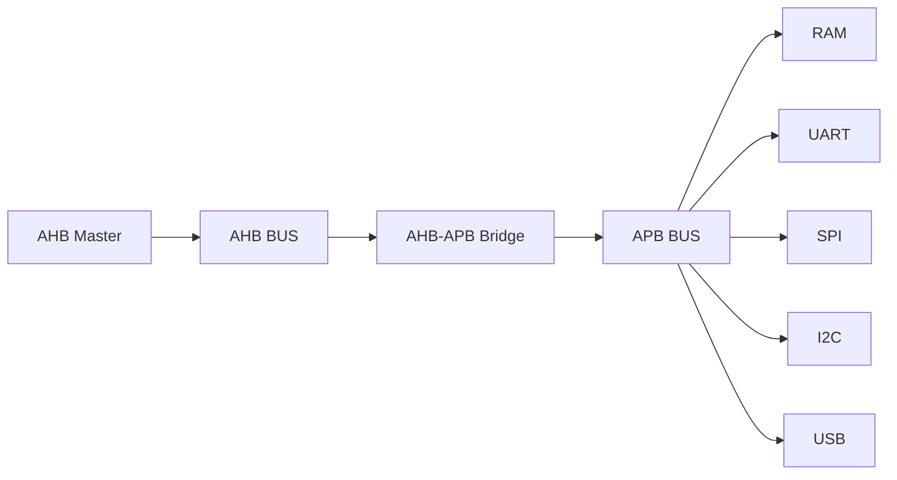
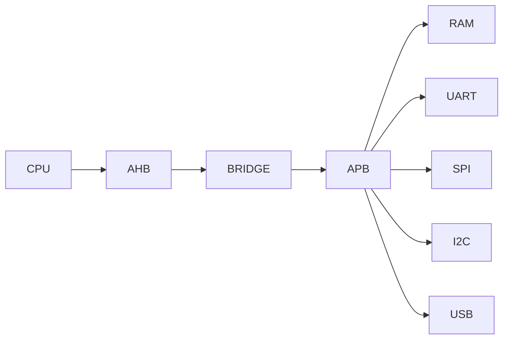

<h1 align="center"> AMBA-Based SoC Design (Peripheral → On-Chip → Full Integration) </h1>

<p align="center">


</p>

---

<p align="center">
A complete System-on-Chip built step by step — starting from basic communication protocols and ending with a fully integrated AMBA-based system.
</p>

---

# Overview

This project demonstrates the complete development of a **System-on-Chip (SoC)** from the ground up.

The design follows a structured flow:

- Communication protocols (UART, SPI, I2C, USB)  
- On-chip bus architecture (AHB, APB)  
- Protocol bridging  
- Peripheral integration using APB wrappers  
- Full system-level integration  

Each block is designed independently and then integrated into a unified architecture.

---

# System Architecture




- AHB acts as the **high-speed backbone**  
- APB is used for **low-speed peripheral access**  
- The bridge connects both domains  
- Peripherals are accessed through memory-mapped addressing  

---

# Design Flow

## Phase 1: Peripheral Protocols

🔹 UART  
  https://github.com/rajesh042005/UART-Design-and-RTL-to-GDS-Implementation-using-OpenROAD  

🔹 SPI  
  https://github.com/rajesh042005/SPI-Design-and-RTL-to-GDS-Implementation-using-OpenROAD  

🔹 I2C  
  https://github.com/rajesh042005/I2C-Protocol-RTL-to-GDS-OpenROAD  

🔹 USB  
  https://github.com/rajesh042005/usb-rtl-design  

### Highlights

- FSM-based protocol design  
- Accurate timing and control logic  
- RTL-to-GDS validation using OpenROAD  

---

## Phase 2: On-Chip Bus Design

🔹 AHB Bus + Master  
  https://github.com/rajesh042005/AHB-Bus-Advanced-High-performance-Bus---Verilog-RTL-Design  

🔹 APB Bus  
  https://github.com/rajesh042005/APB-Bus-Advanced-Peripheral-Bus---Verilog-RTL-Design  

### Highlights

- AHB pipelined transaction handling  
- APB simple peripheral communication  
- Address decoding and data routing  

---

## Phase 3: Bridge (Interconnect)

🔹 AHB to APB Bridge  
  https://github.com/rajesh042005/AHB-to-APB-Bridge---Verilog-RTL-Design  

### Highlights

- Conversion from AHB to APB protocol  
- SETUP → ENABLE phase handling  
- Wait state and error management  

---

## Phase 4: APB Wrappers

🔹 APB Wrappers (UART, SPI, I2C, USB, RAM)  
  https://github.com/rajesh042005/APB-Peripheral-Wrappers---Verilog-RTL-Design  

### Highlights

- APB interface to peripheral control logic  
- Register-based access model  
- Pulse-based triggering (start, enable)  

---

## Phase 5: SoC Integration

🔹 SoC Top  
  https://github.com/rajesh042005/SoC-Top-Design---AMBA-AHB-to-APB-Based-System  

### Highlights

- Full system integration  
- AHB → Bridge → APB connectivity  
- Memory-mapped architecture  

---

## Phase 6: Architecture Documentation

- 🔹 System Documentation  
  https://github.com/rajesh042005/SoC-Communication-Architecture-Peripheral-On-Chip-Integration  

### Highlights

- System-level visualization  
- Protocol relationships  
- Integration flow clarity  

---

# Data Flow


1. CPU initiates transaction  
2. AHB carries address and control  
3. Bridge converts protocol  
4. APB selects the target peripheral  
5. Peripheral performs operation  
6. Result returns to CPU  

---

# Address Mapping

| Address Range | Peripheral |
|--------------|-----------|
| 0x0000_0000 | RAM |
| 0x0000_1000 | UART |
| 0x0000_2000 | SPI |
| 0x0000_3000 | I2C |
| 0x0000_4000 | USB |


- Address decoding is handled by APB bus  
- Higher address bits (`paddr[15:12]`) select the peripheral  
- Only one peripheral is active per transaction  

---

# Key Features

- Complete AMBA-based SoC design  
- Modular and reusable RTL components  
- Clear separation of high-speed and low-speed domains  
- Memory-mapped peripheral access  
- Protocol conversion using bridge  

---

# Design Strength

- Covers full design flow from protocol to system  
- Demonstrates understanding of:
  - communication protocols  
  - bus architectures  
  - system integration  
- Clean hierarchical structure:

```
Peripheral → Wrapper → APB → Bridge → AHB → CPU
```

---

# Final System


---

<p align="center"><b>
A complete System-on-Chip integrating multiple protocols using AMBA architecture.

---

